# Boas-vindas ao repositório do Projeto Store Manager!

# Entregáveis

<details>
  <summary><strong>👨‍💻 O que deverá ser desenvolvido</strong></summary>

Você vai desenvolver sua primeira API utilizando a arquitetura MSC (model-service-controller)!

A API a ser construída é um sistema de gerenciamento de vendas no formato dropshipping em que será possível criar, visualizar, deletar e atualizar produtos e vendas. Você deverá utilizar o banco de dados MySQL para a gestão de dados. Além disso, a API deve ser RESTful.

  <br />
</details>

<br />

# Orientações

<details>
  <summary><strong>🐳 Rodando no Docker vs Localmente</strong></summary>

### 👉 Com Docker

**:warning: Antes de começar, seu docker-compose precisa estar na versão 1.29 ou superior. [Veja aqui](https://www.digitalocean.com/community/tutorials/how-to-install-and-use-docker-compose-on-ubuntu-20-04-pt) ou [na documentação](https://docs.docker.com/compose/install/) como instalá-lo. No primeiro artigo, você pode substituir onde está com `1.26.0` por `1.29.2`.**

> :information_source: Rode os serviços `node` e `db` com o comando `docker-compose up -d`.

- Lembre-se de parar o `mysql` se estiver usando localmente na porta padrão (`3306`), ou adapte, caso queria fazer uso da aplicação em containers;
- Esses serviços irão inicializar um container chamado `store_manager` e outro chamado `store_manager_db`;
- A partir daqui você pode rodar o container `store_manager` via CLI ou abri-lo no VS Code.

> :information_source: Opção 1: Use o comando `docker-compose run node npm test`, ou para acessar o container e executar lá:

> :information_source: Opção 2: Use o comando `docker exec -it store_manager bash` e sigas passos abaixo.

- Ele te dará acesso ao terminal interativo do container criado pelo compose, que está rodando em segundo plano.

> :information_source: Instale as dependências [**Caso existam**] com `npm install`

- **:warning: Atenção:** Caso opte por utilizar o Docker, **TODOS** os comandos disponíveis no `package.json` (npm start, npm test, npm run dev, ...) devem ser executados **DENTRO** do container, ou seja, no terminal que aparece após a execução do comando `docker exec` citado acima.

- **:warning: Atenção:** O **git** dentro do container não vem configurado com suas credenciais. Ou faça os commits fora do container, ou configure as suas credenciais do git dentro do container.

- **:warning: Atenção:** Não rode o comando npm audit fix! Ele atualiza várias dependências do projeto, e essa atualização gera conflitos com o avaliador.

- **:warning: Atenção:** Se você se deparar com o erro abaixo, quer dizer que sua aplicação já esta utilizando a `porta 3000`, seja com outro processo do Node.js (que você pode parar com o comando `killall node`) ou algum container! Neste caso você pode parar o container com o comando `docker stop <nome-do-container>`.

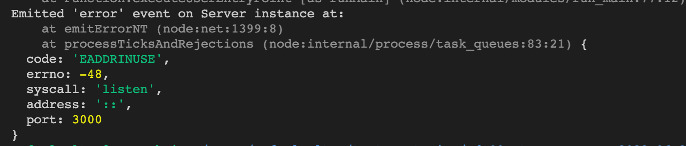

- ✨ **Dica:** Antes de iniciar qualquer coisa, observe os containers que estão em execução em sua máquina. Para ver os containers em execução basta usar o comando `docker container ls`, caso queira parar o container basta usar o comando `docker stop nomeContainer` e se quiser parar e excluir os containers, basta executar o comando `docker-compose down`

- ✨ **Dica:** A extensão `Remote - Containers` (que estará na seção de extensões recomendadas do VS Code) é indicada para que você possa desenvolver sua aplicação no container Docker direto no VS Code, como você faz com seus arquivos locais.


 <br />

### 👉 Sem Docker

> :information_source: Instale as dependências [**Caso existam**] com `npm install`

- **:warning: Atenção:** Não rode o comando npm audit fix! Ele atualiza várias dependências do projeto, e essa atualização gera conflitos com o avaliador.

- **:warning: Atenção:** Não esqueça de renomear/configurar o arquivo `.env.example` para os testes locais funcionarem.
- **:warning: Atenção:** Para rodar o projeto desta forma, **obrigatoriamente** você deve ter o `Node.js` instalado em seu computador.
- **:warning: Atenção:** A versão do `Node.js` e `NPM` a ser utilizada é `"node": ">=16.0.0"` e `"npm": ">=7.0.0"`, como descrito a chave `engines` no arquivo `package.json`. Idealmente deve-se utilizar o Node.js na `versão 16.14`, a versão na que esse projeto foi testado.

  <br/>

</details>

<details>
  <summary><strong>🐞🗡️ Depuração (Debugger)</strong></summary>

  Existe nesse projeto uma configuração de depuração para o VScode, localizada na pasta `.vscode`.
  
  Dito isso você pode clicar no ícone de _Debugger_ ou usar a _shortcut_ `Ctrl + Shift + D` (no linux) para abrí-lo:
  
  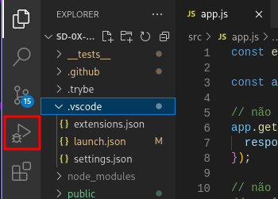

  Vai parecer uma interface assim no canto superior do seu VScode:

  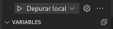

  O simbolo 🔽 é uma caixa de seleção, como um `<select>` HTML, este abriga os modos de depuração que o VScode encontrou.

   1. Depurar Localmente
    - Executa sua API usando o `nodemon` e com o _debugger_ do VScode ativo. Você poderá acessar sua API normalmente, mas o código parará de executar nos _breakpoints_ que definir.
   2. Depurar com Docker
    - Como o último, mas o VScode usa a porta `9229` para atracar com o código da API no _container_, se quiser fazer requisições para API deve usar a porta que o _container_ mapeou para o `localhost`
   3. Depurar testes local Estudante
    - Invés de executar a API em modo de depuração, executa o _script_ de testes do `mocha` que deve criar para esse projeto. Você pode usar os _breakpoints_ da mesma forma.
   4. Depurar testes local Trybe
    - Como o último, mas com os testes da Trybe
  
  Para iniciar a depuração basta clicar no _play_ verde ▶️.

  Inicialmente vai parecer que nada aconteceu, mas vai aparecer essa barrinha no topo da sua tela:

  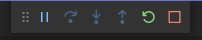

  Agora você consegue ativar os _breakpoints_ ⏺️ ao lado do número da linha,
  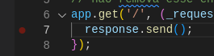
  
  Quando clicar nele, este ficar vermelho e quando a API executar essa linha, ela vai parar.

  Com tudo preparado, vamos fazer um teste, vou fazer uma requisição para acionar a execução da linha 7 do `src/app.js`:

  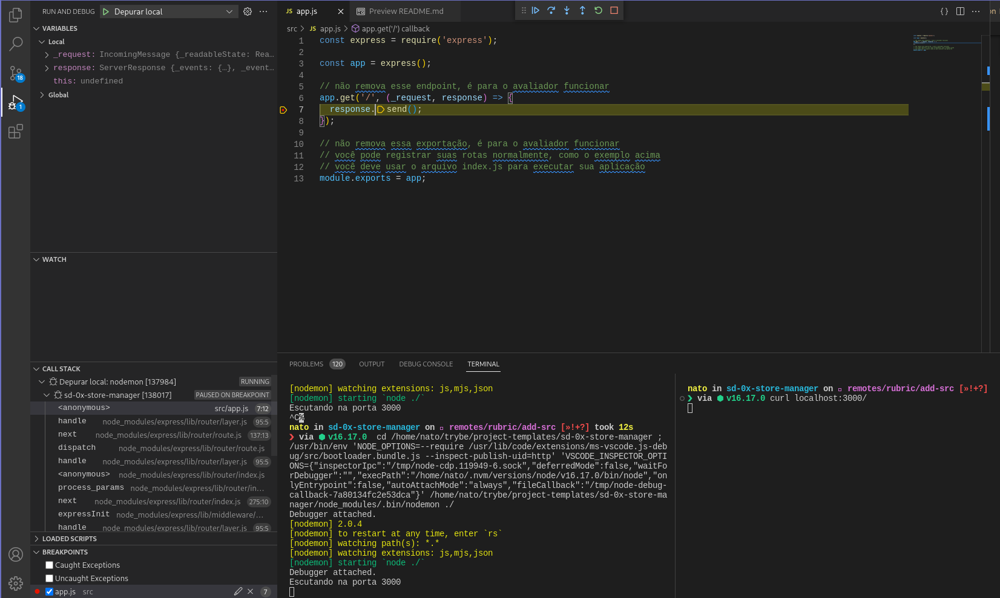

  Note que todas a variáveis do escopo local (`_request`, `response`, `this`) de onde o cursor está podem ser inspecionadas.
  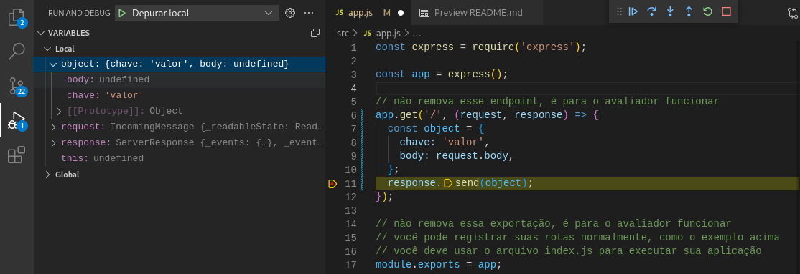

  Agora é com você! ✨

  Mas vou deixar aqui uma colinha de como funciona cada ícone da barra de depuração:

- ▶️ Continue: Vai executar o código até chegar no próximo _breakpoint_, dar um erro ou não haver mais o que executar;
- ⤵️ Step Over: Executa linha atual e pula para a próxima;
- ⬇️ Step Into: Entra dentro da função que vai ser executada na linha do cursor;
- ⬆️ Step Out: Saí da função que vai ser executada na linha do cursor, executando o resto dela;
- 🔄 Restart: Reinicia o processo de depuração, matando o processo atual e criando um novo.
- ⏹️ Stop: Para o processo de depuração, mata o processo.

> 💡 Anota a dica: talvez você tenha se perguntado: uai, mas não tem como voltar? Realmente não tem, é um processo que só vai na direção que o código executa. Logo, para "voltar uma linha" é preciso que ativemos o gatilho que faz o depurador passar por aquela linha que a gente quer voltar, fazendo uma nova requisição por exemplo.

</details>

<details>
  <summary><strong>‼️ Antes de começar a desenvolver</strong></summary>

1. Clone o repositório

- `git clone git@github.com:tryber/sd-025-b-store-manager.git`;

- Entre na pasta do repositório que você acabou de clonar:
  - `cd sd-025-b-store-manager`

2. Instale as dependências [**Caso existam**]

- `npm install`

#### :warning: ATENÇÃO: Não rode o comando `npm audit fix`! _Ele atualiza várias dependências do projeto, e essa atualização gera conflitos com o avaliador._

3. Crie uma branch a partir da branch `master`

- Verifique que você está na branch `master`
  - Exemplo: `git branch`
- Se não estiver, mude para a branch `master`
  - Exemplo: `git checkout master`
- Agora crie uma branch à qual você vai submeter os `commits` do seu projeto
  - Você deve criar uma branch no seguinte formato: `nome-de-usuario-nome-do-projeto`
  - Exemplo: `git checkout -b joaozinho-sd-025-b-store-manager`

4. Adicione as mudanças ao _stage_ do Git e faça um `commit`

- Verifique que as mudanças ainda não estão no _stage_
  - Exemplo: `git status` (deve aparecer listada a pasta _joaozinho_ em vermelho)
- Adicione o novo arquivo ao _stage_ do Git
  - Exemplo:
    - `git add .` (adicionando todas as mudanças - _que estavam em vermelho_ - ao stage do Git)
    - `git status` (deve aparecer listado o arquivo _joaozinho/README.md_ em verde)
- Faça o `commit` inicial
  - Exemplo:
    - `git commit -m 'iniciando o projeto x'` (fazendo o primeiro commit)
    - `git status` (deve aparecer uma mensagem tipo _nothing to commit_ )

5. Adicione a sua branch com o novo `commit` ao repositório remoto

- Usando o exemplo anterior: `git push -u origin joaozinho-sd-025-b-store-manager`

6. Crie um novo `Pull Request` _(PR)_

- Vá até a página de _Pull Requests_ do [repositório no GitHub](https://github.com/tryber/sd-025-b-store-manager/pulls)
- Clique no botão verde _"New pull request"_
- Clique na caixa de seleção _"Compare"_ e escolha a sua branch **com atenção**
- Clique no botão verde _"Create pull request"_
- Adicione uma descrição para o _Pull Request_ e clique no botão verde _"Create pull request"_
- **Não se preocupe em preencher mais nada por enquanto!**
- Volte até a [página de _Pull Requests_ do repositório](https://github.com/tryber/sd-025-b-store-manager/pulls) e confira que o seu _Pull Request_ está criado

  <br />

</details>

<details>
  <summary><strong>🛠 Execução de testes localmente</strong></summary>

> :information_source: IMPORTANTE

- Usaremos o [Jest](https://jestjs.io/pt-BR/) e o [Frisby](https://docs.frisbyjs.com/) para fazer os testes de API.
- Na seção [Informações Importantes](#informacao-importante), está especificado como a conexão deve ser feita, para que os testes rodem.
- Este projeto já vem configurado e com suas dependências.
- Para poder executar os testes basta executar comando `npm test` _(lembre-se de que se estiver usando Docker, rodar esse comando dentro do container)_

### :eyes: De olho na Dica: executando os testes

Para este projeto você pode rodar os testes das seguintes maneiras.

- Executando todos: `npm test`
- Executando um por vez: `npm test req02`
- **:warning: Atenção:** lembre-se de que se estiver usando Docker, rodar esse comando dentro do container.

  <br />

</details>

<details>
  <summary id="informacao-importante"><strong>⚠️ Informações importantes sobre o projeto</strong></summary>

- A pessoa usuária, independente de cadastro, deve conseguir:

  - Adicionar, ler, deletar e atualizar produtos;
  - Enviar vendas para o sistema e essas vendas devem validar se o produto em questão existe;
  - Ler, deletar e atualizar vendas.

- Para **todos os endpoints** garanta que:

  - Caso o recurso **não seja encontrado**, **aconteça um erro** ou **haja dados inválidos** na sua requisição, sua API deve retornar o status HTTP adequado com o body `{ message: <mensagem de erro> }`;
  - Garanta que seus endpoints sempre retornem uma resposta, havendo sucesso nas operações ou não;
  - Garanta que seus endpoints sempre retornem os códigos de status corretos _(recurso criado, erro de validação, autorização, etc)_.
  - Use os verbos HTTP adequados para cada operação;
  - Agrupe e padronize suas URL em cada recurso;

- Cada camada da sua API deve estar em seu respectivo diretório:
  - A camada **Models** deve estar no diretório de nome `./src/models`;
  - A camada **Services** deve estar no diretório de nome `./src/services`;
  - A camada **Controllers** deve estar no diretório de nome `./src/controllers`;
  - Os **Middlewares** devem estar no diretório de nome `./src/middlewares`.

**:warning: Atenção:** Os diretórios já estão criados, não altere os nomes, não os mova de lugar e nem os deixe vazios. Você pode criar mais diretórios como `utils`, `helpers`, `database`... entre outros, mas não alterar os citados acima.

- Em suas models:

  - Colocar o nome do banco de dados antes do nome da tabela, **ex: `banco_de_dados.tabela`**;
  - Atente-se a detalhes de digitação em seu código. Qualquer diferença em nomes, apelidos, CAIXA ALTA ou caixa baixa podem invalidar suas respostas.

  ```SQL
    -- exemplo de escrita de query
    SELECT * FROM StoreManager.products;
  ```

:warning: **Em seus arquivos de `models`, `controllers` e `services` não importe funções desestruturando**, pois esta forma de importação dá problemas nos `stubs` dos testes unitários com `sinon`;
 
  _Todos os exemplos abaixo são apenas demonstrativos para ilustrar a explicação._
  
  Ou seja, em vez de fazer um código assim:

  ```javascript
  const { getAll } = require("../services/product"); 
  
  const getAll = async (req, res) => {
    const products = await getAll();
  
    res.status(200).json(products);
  };
  // ...
  ```
  
  Faça assim:
  
  ```javascript
  /* Importe o objeto completo ...*/
  const productService = require("../services/product"); 
  
  /* ... e quando for necessário chamar uma função, use o objeto para fazer essa chamada */
  const getAll = async (req, res) => {
    const products = await productService.getAll();
  
    res.status(200).json(products);
  };
  // ...
  ```
  
**Obs:** Caso esteja utilizando _barrel_ não existe problema algum em usar a desestruturação, pois nesses casos você estará importando um **objeto** e não uma **função**.

  Faça assim:
  
  ```javascript
  // src/services/index.js
  const productService = require("../services/product"); 
  
  /* Aqui está sendo envelopado o objeto productService dentro de um outro objeto! */
  module.exports = {
    productService,
  };
  ```
 
  Quando for utilizar, faça algo desse tipo:
 
  ```javascript
  // src/services/index.js
  /* Importe o objeto desestruturando pois está importando do barrel */
  const { productService } = require("../services"); 
  
  /* Aqui continue usando o objeto da forma normal */
  const getAll = async (req, res) => {
    const products = await productService.getAll();
  
    res.status(200).json(products);
  };
  ```

---

### :warning: Atenção aos arquivos entregues

- Há um arquivo `./src/app.js` no repositório, não remova o seguinte trecho de código:

  ```javascript
  app.get("/", (request, response) => {
    response.send();
  });

  module.exports = app;
  ```

  - Isso está configurado para o avaliador funcionar;
  - É neste arquivo que você irá configurar suas rotas.

- Há um arquivo `./src/server.js` no repositório, não altere a seguinte estrutura:

  ```Javascript
    const app = require('./app');
    require('dotenv').config();

    // não altere esse arquivo, essa estrutura é necessária para à avaliação do projeto

    app.listen(process.env.PORT, () => {
      console.log(`Escutando na porta ${process.env.PORT}`);
    });
  ```

  - Isso está configurado para tornar os testes unitários mais fáceis de serem executados.

---

### :warning: Atenção aos arquivos de variáveis de ambiente

- Para os testes rodarem corretamente, na raiz do projeto **renomeie o arquivo `.env.example` para `.env`** com as variáveis de ambiente. Por exemplo, caso o seu usuário SQL seja `nome` e a senha `1234` seu arquivo ficará desta forma:

  ```sh
    MYSQL_HOST=localhost
    MYSQL_USER=nome
    MYSQL_PASSWORD=1234
    MYSQL_DATABASE=StoreManager
    PORT=3000
    HOST=localhost
  ```

  - **Variáveis de ambiente além das especificadas acima não são suportadas, pois não são esperadas pelo avaliador do projeto.**
    - A variável **PORT** do arquivo `.env` deve ser utilizada para a conexão com o servidor. É importante utilizar essa variável para os testes serem executados corretamente tanto na máquina local quanto no avaliador.
  - Com essas configurações, enquanto estiver na máquina local, o banco será executado normalmente via localhost (possibilitando os testes via `npm test`).
    Como o arquivo `.env` não será enviado para o GitHub (não se preocupe com isso, pois já está configurado no `.gitignore`), o avaliador utilizará as suas próprias variáveis de ambiente.

  ```javascript
  require("dotenv").config(); // não se esqueça de configurar suas variáveis de ambiente aqui na configuração

  const connection = mysql.createPool({
    host: process.env.MYSQL_HOST,
    user: process.env.MYSQL_USER,
    password: process.env.MYSQL_PASSWORD,
    database: process.env.MYSQL_DATABASE || "StoreManager",
  });
  ```

    <br />
  </details>

<details>
  <summary id="diagrama-scripts"><strong>🎲 Diagrama ER, Entidades e Scripts</strong></summary>

#### Diagrama de Entidade-Relacionamento

Para orientar a manipulação das tabelas, utilize o DER a seguir:

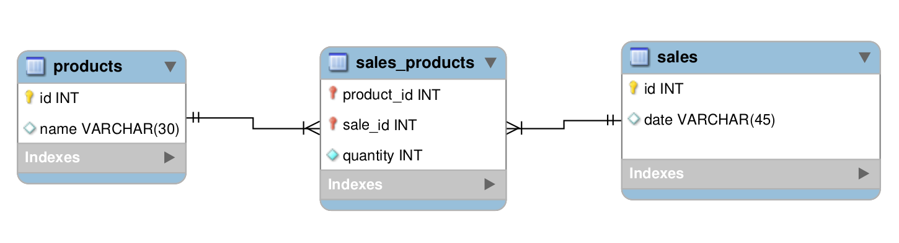

---

#### Tabelas

O banco terá três tabelas:

- A tabela `products`, com os atributos `id` e `name`;
- A tabela `sales`, com os atributos `id` e `date`;
- A tabela `sales_products`, com os atributos `sale_id`, `product_id` e `quantity`;
- O script de criação do banco de dados pode ser visto [aqui](migration.sql);
- O script que popula o banco de dados pode ser visto [aqui](seed.sql);

**:warning: Atenção:** Não exclua, altere ou mova de lugar os arquivos `migration.sql` e `seed.sql`, eles são usados para realizar os testes. Qualquer dúvida sobre estes arquivos procure a monitoria no Slack ou nas mentorias.

A tabela `products` tem o seguinte formato: _(O id será gerado automaticamente)_

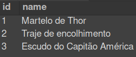

A tabela `sales` tem o seguinte formato: _(O id e date são gerados automaticamente)_

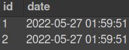

A tabela `sales_products`, é a tabela que faz o relacionamento `N:N` entre `products` e `sales` e tem o seguinte formato: _(O produto e a venda são deletados automaticamente)_

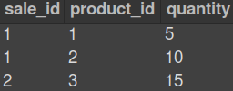

> :warning:️ Em caso de dúvidas, consulte os conteúdos:
>
> - [Arquitetura de Software - Camada de Model](https://app.betrybe.com/learn/course/5e938f69-6e32-43b3-9685-c936530fd326/module/94d0e996-1827-4fbc-bc24-c99fb592925b/section/d8fc0320-73f1-45d4-9f4f-2b6911b176b1/day/6b5ecd71-9499-4ffe-8776-e91e46f93a08/lesson/23b59faa-9946-462e-8e83-c5c9cae36d55)
> - [Arquitetura de Software - Camada de Service](https://app.betrybe.com/learn/course/5e938f69-6e32-43b3-9685-c936530fd326/module/94d0e996-1827-4fbc-bc24-c99fb592925b/section/d8fc0320-73f1-45d4-9f4f-2b6911b176b1/day/6e17b47a-8c39-46f0-aa0f-98d10e689e2d/lesson/78c580fe-7da2-4b59-86ea-e647346c71bd)
> - [Arquitetura de Software - Camada de Controller](https://app.betrybe.com/learn/course/5e938f69-6e32-43b3-9685-c936530fd326/module/94d0e996-1827-4fbc-bc24-c99fb592925b/section/d8fc0320-73f1-45d4-9f4f-2b6911b176b1/day/47e36934-739e-427e-b405-cda3908ff9b1/lesson/dd912f02-25e9-461a-85a6-8500bf3fc202)

---

#### Dicas de scripts prontos

- Criar o banco de dados e gerar as tabelas:

```sh
  npm run migration
```

- Limpar e popular o banco de dados:

```sh
  npm run seed
```

- Iniciar o servidor Node:

```sh
  npm start
```

- Iniciar o servidor Node com nodemon:

```sh
  npm run debug
```

- Executar os testes avaliativos da Trybe:

```sh
  npm test
```

- Executar os testes de unidade escritos por você:

```sh
  npm run test:mocha
```

- Executar o linter:

```sh
  npm run lint
```

**:warning: Atenção:** A alteração desses scripts pode impedir o avaliador de funcionar corretamente.

  <br />
</details>

<details id="para-escrever-seus-próprios-arquivos-de-teste">
  <summary><strong>🔬 Escrevendo testes de unidade</strong></summary><br />

- Utilize o **mocha**, **chai** e **sinon** para escrever seus testes;
- Coloque todos os testes de `models`, `services` e `controllers` dentro da pasta `tests/unit`.
- **:warning: Atenção:** Os nomes dos arquivos de testes devem seguir essa estrutura `nomeDoArquivo.test.js`
- **✨ Dica:** Aqui uma sugestão de arquivos para criar os teste de unidade:

```tree
.
├─ ...
├─ src
├─ tests
│   └─ unit
|       ├─ controllers
│           ├─ productsControllers.test.js
│           └─ salesControllers.test.js
|       ├─ services
│           ├─ productsServices.test.js
│           └─ salesServices.test.js
|       └─ models
│           ├─ productsModels.test.js
│           └─ salesModels.test.js
└─ ...
```

- **✨ Dica:** Aqui como dica, é interessante começar a escrever seus testes de unidade pela camada de `models`. Outra dica é não escrever todos os testes de uma camada só de uma vez! Ex: Crie a função de listar todos os produtos, escreva o teste da camada de `models`, depois `service`, por último `controllers` e vai para a próxima função...

  <br />

</details>

# Requisitos Obrigatórios

## 01 - Crie endpoints para listar produtos

- O endpoint para listar produtos deve ser acessível através do caminho (`/products`) e (`/products/:id`);
- Através do caminho `/products`, todos os produtos devem ser retornados;
- Através do caminho `/products/:id`, apenas o produto com o `id` presente na URL deve ser retornado;
- O resultado da listagem deve ser **ordenado** de forma crescente pelo campo `id`;

<details close>
  <summary>Os seguintes pontos serão avaliados</summary>

- **[Será validado que é possível listar todos os produtos]**

  - Ao listar usuários com sucesso o resultado retornado deverá ser conforme exibido abaixo, com um status http `200`:

  ```json
  [
    {
      "id": 1,
      "name": "Martelo de Thor"
    },
    {
      "id": 2,
      "name": "Traje de encolhimento"
    }
    /* ... */
  ]
  ```

- **[Será validado que não é possível listar um produto que não existe]**

  - Se o produto for inexistente o resultado retornado deverá ser conforme exibido abaixo, com um status http `404`:

  ```json
  { "message": "Product not found" }
  ```

- **[Será validado que é possível listar um produto específico com sucesso]**

  - Ao listar um produto com sucesso o resultado retornado deverá ser conforme exibido abaixo, com um status http `200`:

  ```json
  {
    "id": 1,
    "name": "Martelo de Thor"
  }
  ```

    <br>
  </details>

---

## 02 - Desenvolva testes que cubram no mínimo 5% das camadas da sua aplicação

- Seus arquivos de teste devem ficar no diretório `tests/unit`, como é descrito em [Para escrever seus próprios arquivos de teste](#para-escrever-seus-próprios-arquivos-de-teste);
- Seus testes da `model` devem fazer mock do banco de dados obrigatoriamente;
- Opcionalmente você pode parar o serviço do `MYSQL` em sua máquina. Para rodar seus teste utilize `npm run test:mocha`;
- Antes de executar os testes da Trybe, seus testes não devem conter erros.

<details close>
  <summary>Os seguintes pontos serão avaliados</summary>

- **[Será validado que a cobertura total das linhas e funções dos arquivos de CADA camada `models`, `services` e `controllers` é maior ou igual a 5%. Ou seja, cada uma das camadas tem de ter, ao menos, 5% de cobertura de testes.]**
- **[Será validado que existe um mínimo de 2 funções em CADA camada `models`, `services` e `controllers`.]**

  <br>

</details>

---

## 03 - Crie endpoint para cadastrar produtos

- O endpoint deve ser acessível através do caminho (`/products`);
- Os produtos enviados devem ser salvos na tabela `products` do banco de dados;
- O corpo da requisição deverá seguir o formato abaixo:

```json
{
  "name": "ProdutoX"
}
```

<details close>
  <summary>Os seguintes pontos serão avaliados</summary>

- **[Será validado que é possível cadastrar um produto com sucesso]**

  - Se o produto for criado com sucesso o resultado retornado deverá ser conforme exibido abaixo, com um status http `201`:

  ```json
  {
    "id": 4,
    "name": "ProdutoX"
  }
  ```

    <br>
  </details>

---

## 04 - Crie validações para produtos

- O endpoint de produtos deve ser acessível através do caminho (`/products`);
- Lembre-se, o banco de dados não deve ser acessado nas validações iniciais do corpo da requisição;

<details close>
  <summary>Os seguintes pontos serão avaliados</summary>

- **[Será validado que não é possível realizar operações em um produto sem o campo `name`]**

  - Se a requisição não tiver o campo `name`, o resultado retornado deverá ser conforme exibido abaixo, com um status http `400` :

  ```json
  { "message": "\"name\" is required" }
  ```

- **[Será validado que não é possível realizar operações em um produto com o campo `name` menor que 5 caracteres]**

  - Se a requisição não tiver `name` com pelo menos 5 caracteres, o resultado retornado deverá ser conforme exibido abaixo, com um status http `422`

  ```json
  { "message": "\"name\" length must be at least 5 characters long" }
  ```

    <br>
  </details>

---

## 05 - Desenvolva testes que cubram no mínimo 10% das camadas da sua aplicação

- Seus arquivos de teste devem ficar no diretório `tests/unit`, como é descrito em [Para escrever seus próprios arquivos de teste](#para-escrever-seus-próprios-arquivos-de-teste);
- Seus testes da `model` devem fazer mock do banco de dados obrigatoriamente;
- Opcionalmente você pode parar o serviço do `MYSQL` em sua máquina. Para rodar seus teste utilize `npm run test:mocha`;
- Antes de executar os testes da Trybe, seus testes não devem conter erros.

<details close>
  <summary>Os seguintes pontos serão avaliados</summary>

- **[Será validado que a cobertura total das linhas e funções dos arquivos de CADA camada `models`, `services` e `controllers` é maior ou igual a 10%. Ou seja, cada uma das camadas tem de ter, ao menos, 10% de cobertura de testes.]**
- **[Será validado que existe um mínimo de 3 funções em CADA camada `models`, `services` e `controllers`.]**
  <br>

</details>

---

## 06 - Crie endpoint para validar e cadastrar vendas

- O endpoint de vendas deve ser acessível através do caminho (`/sales`);
- As vendas enviadas devem ser salvas nas tabelas `sales` e `sales_products` do banco de dados;
- Deve ser possível cadastrar a venda de vários produtos através da uma mesma requisição;
- O corpo da requisição deverá seguir o formato abaixo:

```json
[
  {
    "productId": 1,
    "quantity": 1
  },
  {
    "productId": 2,
    "quantity": 5
  }
]
```

<details close>
  <summary>Os seguintes pontos serão avaliados</summary>

- **[Será validado que não é possível realizar operações em uma venda sem o campo `productId`]**

  - Se algum dos itens da requisição não tiver o campo `productId`, o resultado retornado deverá ser conforme exibido abaixo, com um status http `400`:

  ```json
  { "message": "\"productId\" is required" }
  ```

- **[Será validado que não é possível realizar operações em uma venda sem o campo `quantity`]**

  - Se algum dos itens da requisição não tiver o campo `quantity`, o resultado retornado deverá ser conforme exibido abaixo, com um status http `400` :

  ```json
  { "message": "\"quantity\" is required" }
  ```

- **[Será validado que não é possível realizar operações em uma venda com o campo `quantity` menor ou igual a 0 (Zero)]**

  - Se a requisição tiver algum item em que o campo `quantity` seja menor ou igual a zero, o resultado retornado deverá ser conforme exibido abaixo, com um status http `422`

  ```json
  { "message": "\"quantity\" must be greater than or equal to 1" }
  ```

- **[Será validado que não é possível realizar operações em uma venda com o campo `productId` inexistente, em uma requisição com um único item]**

  - Se o campo `productId` do item da requisição não existir no banco de dados, o resultado retornado deverá ser conforme exibido abaixo, com um status http `404`

  ```json
  { "message": "Product not found" }
  ```

- **[Será validado que não é possível realizar operações em uma venda com o campo `productId` inexistente, em uma requisição com vários items]**

  - Se a requisição tiver algum item cujo campo `productId` não existe no banco de dados, o resultado retornado deverá ser conforme exibido abaixo, com um status http `404`

  ```json
  { "message": "Product not found" }
  ```

- **[Será validado que é possível cadastrar uma venda com sucesso]**

  - Se a venda for criada com sucesso o resultado retornado deverá ser conforme exibido abaixo, com um status http `201`:

  ```json
  {
    "id": 3,
    "itemsSold": [
      {
        "productId": 1,
        "quantity": 1
      },
      {
        "productId": 2,
        "quantity": 5
      }
    ]
  }
  ```

    <br>
  </details>

> 💬 Em caso de dúvidas, lembre-se de consultar a seção [Dicas](#dicas) e [Diagrama ER, Entidades e Scripts](#diagrama-scripts)

---

## 07 - Desenvolva testes que cubram no mínimo 15% das camadas da sua aplicação

- Seus arquivos de teste devem ficar no diretório `tests/unit`, como é descrito em [Para escrever seus próprios arquivos de teste](#para-escrever-seus-próprios-arquivos-de-teste);
- Seus testes da `model` devem fazer mock do banco de dados obrigatoriamente;
- Opcionalmente você pode parar o serviço do `MYSQL` em sua máquina. Para rodar seus teste utilize `npm run test:mocha`;
- Antes de executar os testes da Trybe, seus testes não devem conter erros.

<details close>
  <summary>Os seguintes pontos serão avaliados</summary>

- **[Será validado que a cobertura total das linhas e funções dos arquivos de CADA camada `models`, `services` e `controllers` é maior ou igual a 15%. Ou seja, cada uma das camadas tem de ter, ao menos, 15% de cobertura de testes.]**
- **[Será validado que existe um mínimo de 4 funções em CADA camada `models`, `services` e `controllers`.]**

  <br>

</details>

---

## 08 - Crie endpoints para listar vendas

- O endpoint para listar vendas deve ser acessível através do caminho (`/sales`) e (`/sales/:id`);
- Através do caminho `/sales`, todas as vendas devem ser retornadas;
- Através do caminho `/sales/:id`, apenas a venda com o `id` presente na URL deve ser retornada;
- o resultado deve ser **ordenado** de forma crescente pelo campo `saleId`, em caso de empate, **ordenar** também de forma crescente pelo campo `productId`;

<details close>
  <summary>Os seguintes pontos serão avaliados</summary>

- **[Será validado que é possível listar todas as vendas]**

  - Ao listar vendas com sucesso o resultado retornado deverá ser conforme exibido abaixo, com um status http `200`:

  ```json
  [
    {
      "saleId": 1,
      "date": "2021-09-09T04:54:29.000Z",
      "productId": 1,
      "quantity": 2
    },
    {
      "saleId": 1,
      "date": "2021-09-09T04:54:54.000Z",
      "productId": 2,
      "quantity": 2
    }

    /* ... */
  ]
  ```

- **[Será validado que não é possível listar uma venda que não existe]**

  - Se a venda for inexistente o resultado retornado deverá ser conforme exibido abaixo, com um status http `404`:

  ```json
  { "message": "Sale not found" }
  ```

- **[Será validado que é possível listar uma venda específica com sucesso]**

  - Ao listar uma venda com sucesso o resultado retornado deverá ser conforme exibido abaixo, com um status http `200`:

  ```json
  [
    {
      "date": "2021-09-09T04:54:29.000Z",
      "productId": 1,
      "quantity": 2
    },
    {
      "date": "2021-09-09T04:54:54.000Z",
      "productId": 2,
      "quantity": 2
    }

    /* ... */
  ]
  ```

    <br>
  </details>

---

## 09 - Desenvolva testes que cubram no mínimo 20% das camadas da sua aplicação

- Seus arquivos de teste devem ficar no diretório `tests/unit`, como é descrito em [Para escrever seus próprios arquivos de teste](#para-escrever-seus-próprios-arquivos-de-teste);
- Seus testes da `model` devem fazer mock do banco de dados obrigatoriamente;
- Opcionalmente você pode parar o serviço do `MYSQL` em sua máquina. Para rodar seus teste utilize `npm run test:mocha`;
- Antes de executar os testes da Trybe, seus testes não devem conter erros.

<details close>
  <summary>Os seguintes pontos serão avaliados</summary>

- **[Será validado que a cobertura total das linhas e funções dos arquivos de CADA camada `models`, `services` e `controllers` é maior ou igual a 20%. Ou seja, cada uma das camadas tem de ter, ao menos, 20% de cobertura de testes.]**
- **[Será validado que existe um mínimo de 6 funções em CADA camada `models`, `services` e `controllers`.]**
  <br>

</details>

---

## 10 - Crie endpoint para atualizar um produto

- O endpoint deve ser acessível através do caminho (`/products/:id`);
- Apenas o produto com o `id` presente na URL deve ser atualizado;
- O corpo da requisição deve ser validado igual no cadastro;
- O corpo da requisição deverá seguir o formato abaixo:

```json
{
  "name": "Martelo do Batman"
}
```

<details close>
  <summary>Os seguintes pontos serão avaliados</summary>
  
- **[Será validado que não é possível alterar um produto que não existe]**
  - Se o produto for inexistente o resultado retornado deverá ser conforme exibido abaixo, com um status http `404`:

    ```json
      { "message": "Product not found" }
    ```

- **[Será validado que é possível alterar um produto com sucesso]**

  - Se o produto for alterado com sucesso o resultado retornado deverá ser conforme exibido abaixo, com um status http `200`:

  ```json
  {
    "id": 1,
    "name": "Martelo do Batman"
  }
  ```

    <br>
  </details>

---

## 11 - Desenvolva testes que cubram no mínimo 25% das camadas da sua aplicação

- Seus arquivos de teste devem ficar no diretório `tests/unit`, como é descrito em [Para escrever seus próprios arquivos de teste](#para-escrever-seus-próprios-arquivos-de-teste);
- Seus testes da `model` devem fazer mock do banco de dados obrigatoriamente;
- Opcionalmente você pode parar o serviço do `MYSQL` em sua máquina. Para rodar seus teste utilize `npm run test:mocha`;
- Antes de executar os testes da Trybe, seus testes não devem conter erros.

<details close>
  <summary>Os seguintes pontos serão avaliados</summary>

- **[Será validado que a cobertura total das linhas e funções dos arquivos de CADA camada `models`, `services` e `controllers` é maior ou igual a 25%. Ou seja, cada uma das camadas tem de ter, ao menos, 25% de cobertura de testes.]**
- **[Será validado que existe um mínimo de 7 funções em CADA camada `models`, `services` e `controllers`.]**
  <br>

</details>

---

## 12 - Crie endpoint para deletar um produto

- O endpoint deve ser acessível através do caminho (`/products/:id`);
- Apenas o produto com o `id` presente na URL deve ser deletado;

<details close>
  <summary>Os seguintes pontos serão avaliados</summary>
  
- **[Será validado que não é possível deletar um produto que não existe]**
  - Se o produto for inexistente o resultado retornado deverá ser conforme exibido abaixo, com um status http `404`:

    ```json
      { "message": "Product not found" }
    ```

- **[Será validado que é possível deletar um produto com sucesso]**

  - Se o produto for deletado com sucesso não deve ser retornada nenhuma resposta, apenas um status http `204`;

    <br>
  </details>

> 💬 Em caso de dúvidas, lembre-se de consultar a seção [Diagrama ER, Entidades e Scripts](#diagrama-scripts)

---

# Requisitos Bônus

## 13 - Desenvolva testes que cubram no mínimo 30% das camadas da sua aplicação

- Seus arquivos de teste devem ficar no diretório `tests/unit`, como é descrito em [Para escrever seus próprios arquivos de teste](#para-escrever-seus-próprios-arquivos-de-teste);
- Seus testes da `model` devem fazer mock do banco de dados obrigatoriamente;
- Opcionalmente você pode parar o serviço do `MYSQL` em sua máquina. Para rodar seus teste utilize `npm run test:mocha`;
- Antes de executar os testes da Trybe, seus testes não devem conter erros.

<details close>
  <summary>Os seguintes pontos serão avaliados</summary>

- **[Será validado que a cobertura total das linhas e funções dos arquivos de CADA camada `models`, `services` e `controllers` é maior ou igual a 30%. Ou seja, cada uma das camadas tem de ter, ao menos, 30% de cobertura de testes.]**
- **[Será validado que existe um mínimo de 8 funções em CADA camada `models`, `services` e `controllers`.]**
  <br>

</details>

---

## 14 - Crie endpoint para deletar uma venda

- O endpoint deve ser acessível através do caminho (`/sales/:id`);
- Apenas a venda com o `id` presente na URL deve ser deletado;

<details close>
  <summary>Os seguintes pontos serão avaliados</summary>
  
- **[Será validado que não é possível deletar uma venda que não existe]**
  - Se a venda for inexistente o resultado retornado deverá ser conforme exibido abaixo, com um status http `404`:

    ```json
      { "message": "Sale not found" }
    ```

- **[Será validado que é possível deletar uma venda com sucesso]**

  - Se a venda for deletada com sucesso não deve ser retornada nenhuma resposta, apenas um status http `204`;

    <br>
  </details>

> 💬 Em caso de dúvidas, lembre-se de consultar a seção [Diagrama ER, Entidades e Scripts](#diagrama-scripts)

---

## 15 - Desenvolva testes que cubram no mínimo 35% das camadas da sua aplicação

- Seus arquivos de teste devem ficar no diretório `tests/unit`, como é descrito em [Para escrever seus próprios arquivos de teste](#para-escrever-seus-próprios-arquivos-de-teste);
- Seus testes da `model` devem fazer mock do banco de dados obrigatoriamente;
- Opcionalmente você pode parar o serviço do `MYSQL` em sua máquina. Para rodar seus teste utilize `npm run test:mocha`;
- Antes de executar os testes da Trybe, seus testes não devem conter erros.

<details close>
  <summary>Os seguintes pontos serão avaliados</summary>

- **[Será validado que a cobertura total das linhas e funções dos arquivos de CADA camada `models`, `services` e `controllers` é maior ou igual a 35%. Ou seja, cada uma das camadas tem de ter, ao menos, 35% de cobertura de testes.]**
- **[Será validado que existe um mínimo de 9 funções em CADA camada `models`, `services` e `controllers`.]**
  <br>

</details>

---

## 16 - Crie endpoint para atualizar uma venda

- O endpoint deve ser acessível através do caminho (`/sales/:id`);
- Apenas a venda com o `id` presente na URL deve ser atualizada;
- O corpo da requisição deve ser validado igual no cadastro;
- O corpo da requisição deverá seguir o formato abaixo:

```json
[
  {
    "productId": 1,
    "quantity": 10
  },
  {
    "productId": 2,
    "quantity": 50
  }
]
```

<details close>
  <summary>Os seguintes pontos serão avaliados</summary>
  
- **[Será validado que não é possível alterar uma venda que não existe]**
  - Se a venda for inexistente o resultado retornado deverá ser conforme exibido abaixo, com um status http `404`:

    ```json
      { "message": "Sale not found" }
    ```

- **[Será validado que é possível alterar uma venda com sucesso]**

  - Se a venda for alterada com sucesso o resultado retornado deverá ser conforme exibido abaixo, com um status http `200`:

  ```json
    "saleId": 1,
      "itemsUpdated": [
        {
          "productId": 1,
          "quantity":10
        },
        {
          "productId": 2,
          "quantity":50
        }
      ]
  ```

    <br>
  </details>

---

## 17 - Desenvolva testes que cubram no mínimo 40% das camadas da sua aplicação

- Seus arquivos de teste devem ficar no diretório `tests/unit`, como é descrito em [Para escrever seus próprios arquivos de teste](#para-escrever-seus-próprios-arquivos-de-teste);
- Seus testes da `model` devem fazer mock do banco de dados obrigatoriamente;
- Opcionalmente você pode parar o serviço do `MYSQL` em sua máquina. Para rodar seus teste utilize `npm run test:mocha`;
- Antes de executar os testes da Trybe, seus testes não devem conter erros.

<details close>
  <summary>Os seguintes pontos serão avaliados</summary>

- **[Será validado que a cobertura total das linhas e funções dos arquivos de CADA camada `models`, `services` e `controllers` é maior ou igual a 40%. Ou seja, cada uma das camadas tem de ter, ao menos, 40% de cobertura de testes.]**
- **[Será validado que existe um mínimo de 10 funções em CADA camada `models`, `services` e `controllers`.]**
  <br>

</details>

---

## 18 - Crie endpoint products/search?q=searchTerm

- O endpoint deve ser acessível através do URL `/products/search`;
- O endpoint deve ser capaz de trazer os produtos baseados no `q` do banco de dados, se ele existir;
- Sua aplicação deve ser capaz de retornar um array de produtos que contenham em seu nome termo passado na URL;
- Sua aplicação deve ser capaz de retornar um array vazio caso nenhum nome satisfaça a busca;
- O query params da requisição deverá seguir o formato abaixo:

  ```js
    http://localhost:PORT/products/search?q=Martelo
  ```

<details>
  <summary><strong>Os seguintes pontos serão avaliados</strong></summary>

- **[Será validado que é possível buscar um produto pelo `name`]**

  - Se a buscar for feita com sucesso, o resultado retornado deverá ser conforme exibido abaixo, com um status http `200`:

  ```json
  // GET /products/search?q=Martelo

  [
    {
      "id": 1,
      "name": "Martelo de Thor"
    }
  ]
  ```

- **[Será validado que é possível buscar todos os produtos quando passa a busca vazia]** - Se a buscar for vazia o resultado retornado deverá ser conforme exibido abaixo, com um status http `200`:

  ````json
  // GET /products/search?q=

        [
          {
            "id": 1,
            "name": "Martelo de Thor",
          },
          {
            "id": 2,
            "name": "Traje de encolhimento",
          }
          /* ... */
        ]
      ```


  ````

  </details>

---

## 19 - Desenvolva testes que cubram no mínimo 50% das camadas da sua aplicação

- Seus arquivos de teste devem ficar no diretório `tests/unit`, como é descrito em [Para escrever seus próprios arquivos de teste](#para-escrever-seus-próprios-arquivos-de-teste);
- Seus testes da `model` devem fazer mock do banco de dados obrigatoriamente;
- Opcionalmente você pode parar o serviço do `MYSQL` em sua máquina. Para rodar seus teste utilize `npm run test:mocha`;
- Antes de executar os testes da Trybe, seus testes não devem conter erros.

<details close>
  <summary>Os seguintes pontos serão avaliados</summary>

- **[Será validado que a cobertura total das linhas e funções dos arquivos de CADA camada `models`, `services` e `controllers` é maior ou igual a 50%. Ou seja, cada uma das camadas tem de ter, ao menos, 50% de cobertura de testes.]**
- **[Será validado que existe um mínimo de 11 funções em CADA camada `models`, `services` e `controllers`.]**
  <br>

</details>

---

## 20 - Desenvolva testes que cubram no mínimo 60% das camadas da sua aplicação

- Seus arquivos de teste devem ficar no diretório `tests/unit`, como é descrito em [Para escrever seus próprios arquivos de teste](#para-escrever-seus-próprios-arquivos-de-teste);
- Seus testes da `model` devem fazer mock do banco de dados obrigatoriamente;
- Opcionalmente você pode parar o serviço do `MYSQL` em sua máquina. Para rodar seus teste utilize `npm run test:mocha`;
- Antes de executar os testes da Trybe, seus testes não devem conter erros.

<details close>
  <summary>Os seguintes pontos serão avaliados</summary>

- **[Será validado que a cobertura total das linhas e funções dos arquivos de CADA camada `models`, `services` e `controllers` é maior ou igual a 60%. Ou seja, cada uma das camadas tem de ter, ao menos, 60% de cobertura de testes.]**
- **[Será validado que existe um mínimo de 11 funções em CADA camada `models`, `services` e `controllers`.]**
  <br>

</details>
